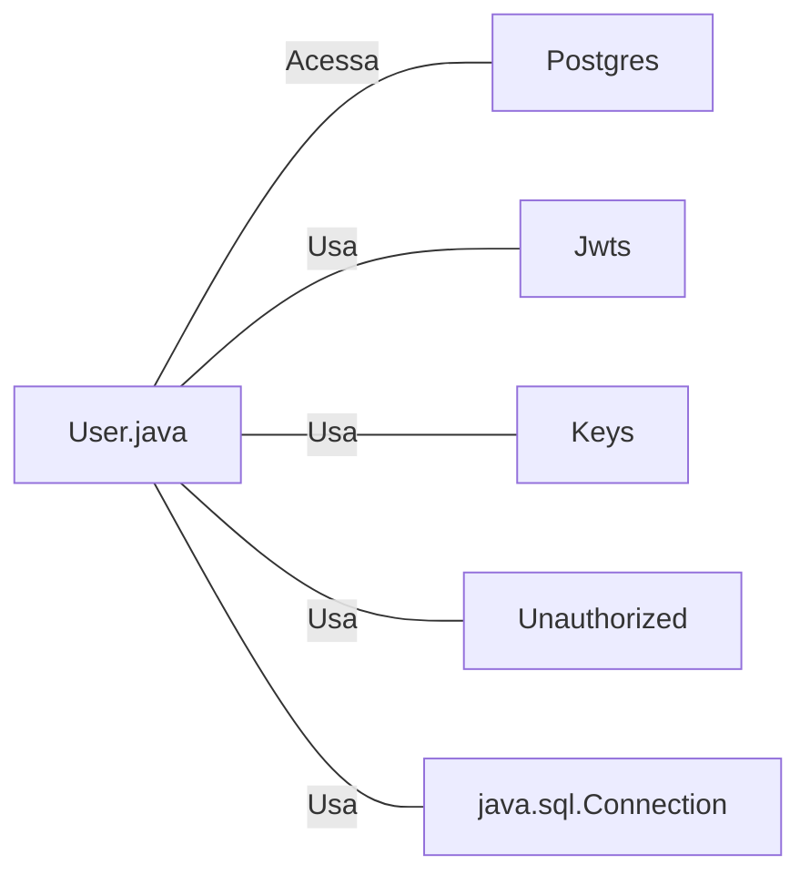

# User.java: Classe de Modelo de Usuário com Autenticação JWT

## Overview

Esta classe representa uma estrutura de dados de usuário que implementa funcionalidades de autenticação baseada em JWT (JSON Web Tokens). A classe é responsável por armazenar dados do usuário, gerar tokens de autenticação, validar tokens existentes e buscar usuários no banco de dados.

## Process Flow

```mermaid
flowchart TD
    subgraph Geração_Token["Geração de Token"]
        A("Início") --> B["Receber secret"]
        B --> C["Criar SecretKey com HMAC"]
        C --> D["Construir JWT com username"]
        D --> E["Assinar e compactar token"]
        E --> F("Retornar JWS")
    end

    subgraph Validação_Auth["Validação de Autenticação"]
        G("Início") --> H["Receber secret e token"]
        H --> I["Criar SecretKey com HMAC"]
        I --> J{"Token válido?"}
        J --> |"Sim"| K("Autenticação OK")
        J --> |"Não"| L["Lançar Unauthorized"]
    end

    subgraph Busca_Usuario["Busca de Usuário"]
        M("Início") --> N["Receber username"]
        N --> O["Abrir conexão com banco"]
        O --> P["Executar query SQL"]
        P --> Q{"Usuário encontrado?"}
        Q --> |"Sim"| R["Criar objeto User"]
        Q --> |"Não"| S["Retornar null"]
        R --> T["Fechar conexão"]
        S --> T
        T --> U("Retornar User")
    end
```



## Insights

- A classe combina responsabilidades de modelo de dados, autenticação e acesso a banco de dados
- O método `fetch` utiliza concatenação de strings para construir queries SQL
- Tokens JWT são gerados usando o algoritmo HMAC com a biblioteca `io.jsonwebtoken`
- A validação de autenticação lança exceção customizada `Unauthorized` em caso de falha
- O método `fetch` contém logging de debug que imprime a query SQL no console

## Dependencies



| Dependência | Descrição |
|-------------|-----------|
| `Postgres` | Classe utilitária para obter conexão com banco de dados PostgreSQL |
| `Jwts` | Biblioteca JJWT para construção e parsing de tokens JWT |
| `Keys` | Utilitário JJWT para geração de chaves criptográficas HMAC |
| `Unauthorized` | Exceção customizada lançada quando autenticação falha |
| `java.sql.*` | Classes JDBC para manipulação de banco de dados |

## Data Manipulation (SQL)

| Entidade | Operação | Descrição |
|----------|----------|-----------|
| `users` | SELECT | Busca um usuário pelo username, retornando userid, username e password |

**Estrutura da Tabela `users`:**

| Atributo | Tipo | Descrição |
|----------|------|-----------|
| userid | String | Identificador único do usuário |
| username | String | Nome de usuário para login |
| password | String | Senha do usuário (armazenada com hash) |

---

## Vulnerabilities

### 1. SQL Injection (Crítica)

O método `fetch` concatena diretamente o parâmetro `un` na query SQL sem sanitização:

```java
String query = "select * from users where username = '" + un + "' limit 1";
```

Isto permite que atacantes injetem código SQL malicioso. O comentário `DROP DATABASE` no código sugere consciência desta vulnerabilidade.

**Impacto:** Acesso não autorizado, vazamento de dados, destruição de dados.

### 2. Exposição de Informações Sensíveis

- A query SQL é impressa no console via `System.out.println`, potencialmente expondo dados sensíveis em logs
- Stack traces de exceções são impressos, revelando detalhes internos da aplicação

### 3. Gerenciamento Inadequado de Recursos

- O `Statement` nunca é fechado explicitamente, causando potencial vazamento de recursos
- O bloco `finally` contém apenas `return`, não garantindo liberação de recursos

### 4. Armazenamento de Segredos

- A chave secreta JWT é passada como String e convertida para bytes, o que pode resultar em chaves fracas dependendo do encoding
- Não há validação do tamanho ou complexidade da chave secreta
