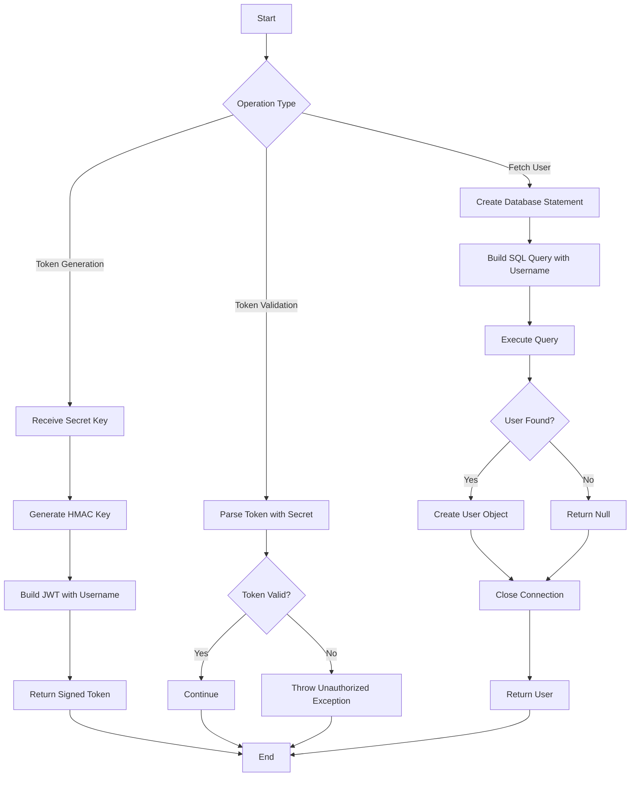
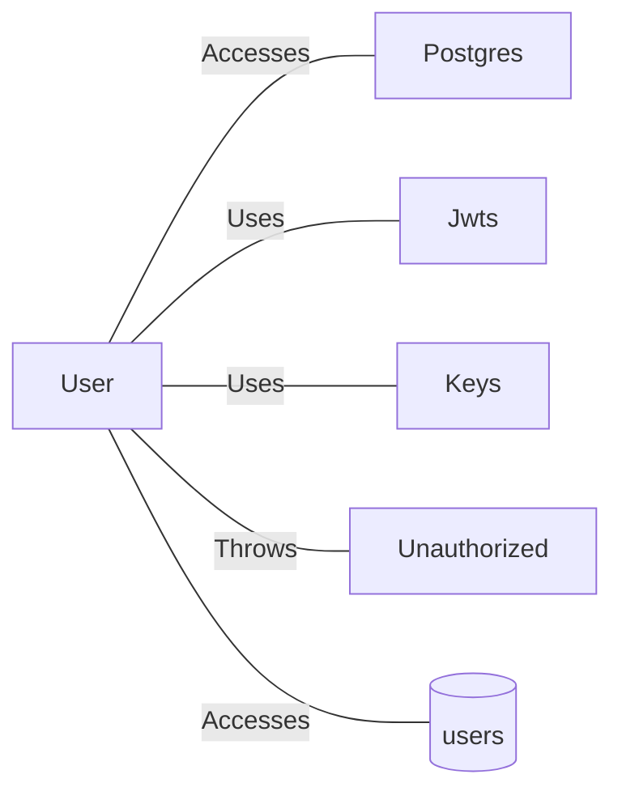

# User.java: User Authentication and Data Access Model

## Overview

This Java class represents a User entity that handles user authentication operations, including JWT (JSON Web Token) generation, token validation, and user data retrieval from a PostgreSQL database. The class combines data structure responsibilities with authentication logic.

## Process Flow

## Insights

- **SQL Injection Vulnerability**: The `fetch` method concatenates user input directly into SQL query without parameterization
- **Hardcoded malicious SQL**: Query contains `DROP DATABASE 1` which appears to be intentional test payload or severe security issue
- **Weak exception handling**: Exceptions are caught and printed but execution continues with potentially null values
- **No password hashing verification**: Password is stored as `hashedPassword` but no verification method exists
- **Connection management issue**: Database connection is obtained and closed within the method but error scenarios may leave connections open
- **JWT implementation uses deprecated methods**: `setSigningKey` and `parser()` methods may be deprecated in newer JJWT versions

## Vulnerabilities

| Vulnerability | Severity | Description |
|--------------|----------|-------------|
| SQL Injection | **Critical** | User input (`un` parameter) is directly concatenated into SQL query in `fetch()` method, allowing attackers to execute arbitrary SQL commands |
| Embedded Malicious SQL | **Critical** | The query contains `DROP DATABASE 1` which could destroy database data |
| Information Disclosure | Medium | Stack traces are printed to stdout/stderr, potentially exposing sensitive system information |
| Improper Error Handling | Medium | Method returns `null` on failure instead of throwing appropriate exceptions, masking errors |
| Resource Leak | Low | Database connections may not be properly closed in all error scenarios |

## Dependencies

| Dependency | Description |
|------------|-------------|
| `Postgres` | Database connection provider; `connection()` method called to obtain database connection |
| `Jwts` | JJWT library class for building and parsing JSON Web Tokens |
| `Keys` | JJWT security utility for generating HMAC signing keys from byte arrays |
| `Unauthorized` | Custom exception class thrown when JWT validation fails |
| `users` | PostgreSQL database table accessed for user authentication data |

## Data Manipulation (SQL)

### User Entity Attributes

| Attribute | Type | Description |
|-----------|------|-------------|
| `id` | String | Unique user identifier |
| `username` | String | User login name |
| `hashedPassword` | String | Stored password hash |

### SQL Operations

| Entity | Operation | Description |
|--------|-----------|-------------|
| `users` | SELECT | Retrieves user record by username; query selects all columns (`user_id`, `username`, `password`) with limit of 1 record |
