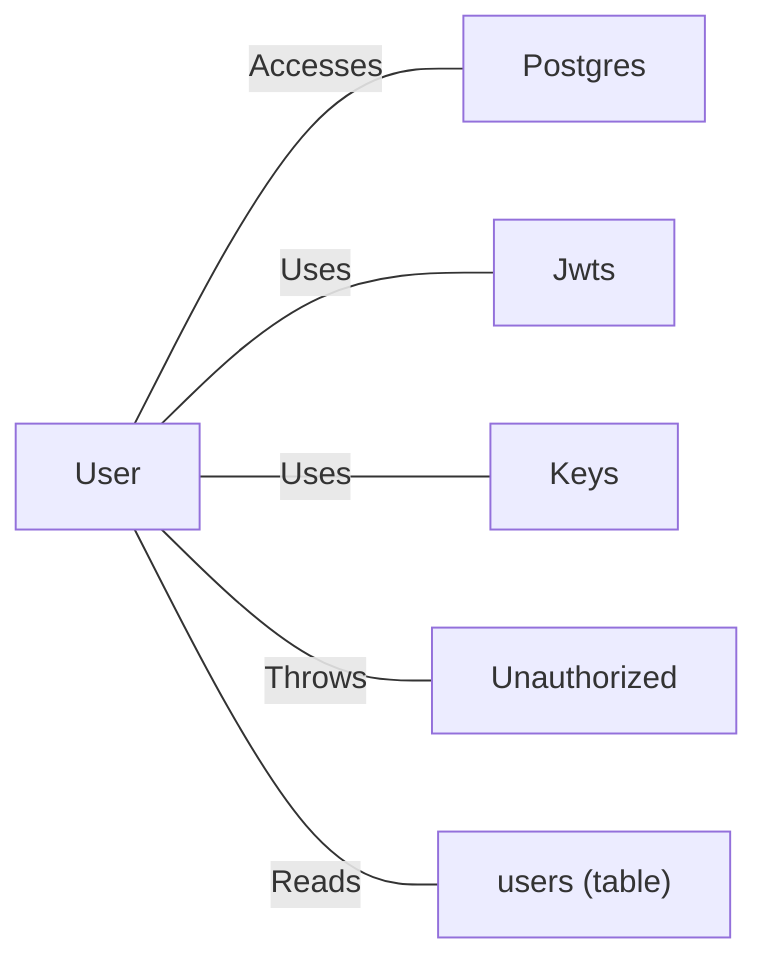

# User.java: User Authentication and Data Access Model

## Overview

This Java class represents a User entity that handles user authentication, JWT token generation, and user data retrieval from a PostgreSQL database. The class combines data structure properties with authentication logic and database operations.

## Process Flow

```mermaid
graph TD
    subgraph Token Generation
        A[Start token] --> B[Generate HMAC Key from Secret]
        B --> C[Build JWT with Username as Subject]
        C --> D[Sign and Compact Token]
        D --> E[Return JWT String]
    end
    
    subgraph Authentication Assertion
        F[Start assertAuth] --> G[Generate HMAC Key from Secret]
        G --> H{Parse and Validate Token}
        H -- Valid --> I[Authentication Successful]
        H -- Invalid --> J[Throw Unauthorized Exception]
    end
    
    subgraph User Fetch
        K[Start fetch] --> L[Open Database Connection]
        L --> M[Build SQL Query with Username]
        M --> N[Execute Query]
        N --> O{Result Found?}
        O -- Yes --> P[Create User Object]
        O -- No --> Q[Return null]
        P --> R[Close Connection]
        Q --> R
        R --> S[Return User]
    end
```

## Vulnerabilities

| Vulnerability | Severity | Location | Description |
|---------------|----------|----------|-------------|
| **SQL Injection** | Critical | `fetch()` method | User input (`un` parameter) is directly concatenated into the SQL query without sanitization or parameterization. Attackers can execute arbitrary SQL commands including dropping tables or extracting sensitive data. |
| **Hardcoded SQL Injection Payload** | Critical | `fetch()` method | The query literally contains `DROP DATABASE` in a comment, suggesting intentional vulnerability demonstration or malicious code. |
| **Sensitive Data Exposure** | Medium | `System.out.println` | SQL queries containing user data are printed to console, potentially exposing sensitive information in logs. |
| **Weak Exception Handling** | Low | `fetch()` method | Exceptions are caught and printed but execution continues, potentially returning null in unexpected states. |
| **Password Storage Visibility** | Medium | Class design | Hashed passwords are stored as public fields, allowing unauthorized access within the application. |

## Insights

- The class uses JJWT library for JWT token operations with HMAC-based signing
- All class fields (`id`, `username`, `hashedPassword`) are declared public, violating encapsulation principles
- The `fetch()` method returns `null` when no user is found or on database errors, making error handling ambiguous
- Database connections are manually managed without using try-with-resources
- The `assertAuth()` method throws a custom `Unauthorized` exception on validation failure

## Dependencies

| Dependency | Description |
|------------|-------------|
| `Postgres` | Database connection provider; `connection()` method is called to obtain a JDBC Connection object |
| `Jwts` | JJWT library class for building and parsing JWT tokens |
| `Keys` | JJWT utility for generating cryptographic keys from byte arrays |
| `Unauthorized` | Custom exception class thrown when JWT validation fails |

## Data Manipulation (SQL)

### User Entity Structure

| Attribute | Type | Description |
|-----------|------|-------------|
| `id` | String | Unique user identifier (mapped from `user_id` column) |
| `username` | String | User's login name |
| `hashedPassword` | String | User's password hash (mapped from `password` column) |

### SQL Operations

| Entity | Operation | Description |
|--------|-----------|-------------|
| `users` | SELECT | Retrieves a single user record by username. **WARNING:** Query is vulnerable to SQL injection and contains malicious payload in source. |
