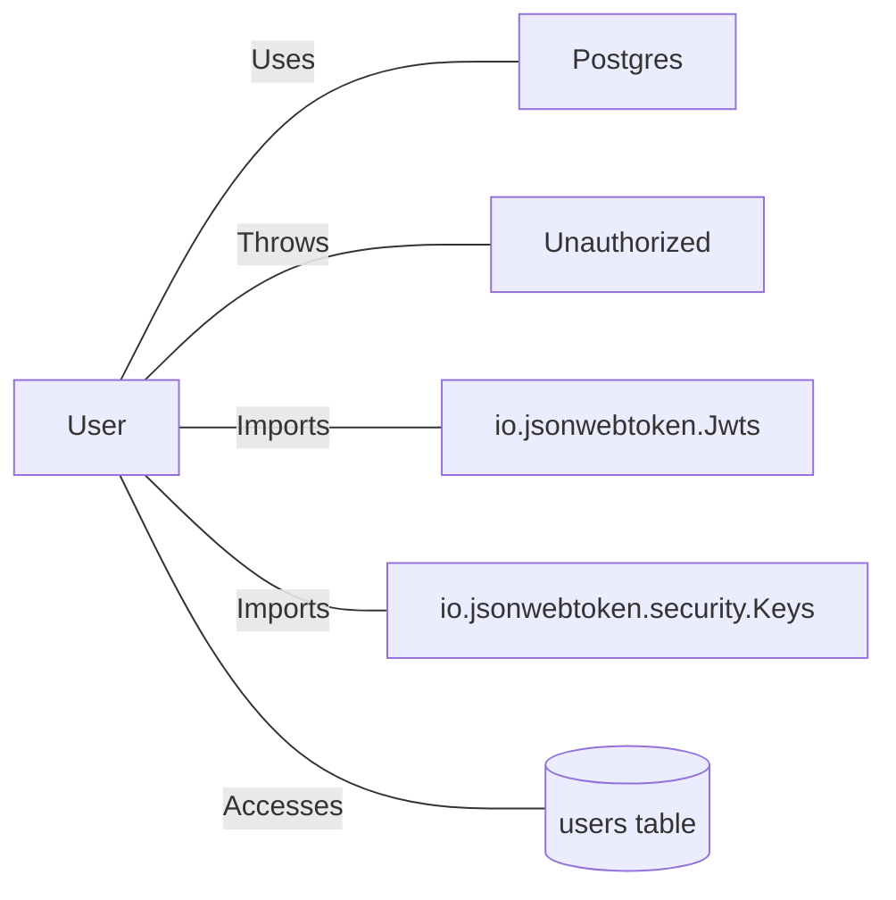

# User.java: User Authentication and Data Access Class

## Overview

This Java class represents a User entity that handles authentication token generation, token validation, and user data retrieval from a PostgreSQL database. The class combines data structure properties with authentication logic using JWT (JSON Web Tokens).

## Process Flow

```mermaid
graph TD
    subgraph Token Generation
        A[token method called] --> B[Generate HMAC SHA Key from secret]
        B --> C[Build JWT with username as subject]
        C --> D[Sign and compact JWT]
        D --> E[Return JWT string]
    end

    subgraph Token Validation
        F[assertAuth called] --> G[Generate HMAC SHA Key from secret]
        G --> H{Parse and validate token}
        H -- Valid --> I[Return successfully]
        H -- Invalid --> J[Throw Unauthorized exception]
    end

    subgraph User Fetch
        K[fetch called with username] --> L[Open database connection]
        L --> M[Build SQL query with username]
        M --> N[Execute query]
        N --> O{Results found?}
        O -- Yes --> P[Create User object]
        O -- No --> Q[Return null]
        P --> R[Close connection]
        R --> S[Return User]
        Q --> R
    end
```

## Vulnerabilities

### 1. SQL Injection (Critical)

| Aspect | Details |
|--------|---------|
| Location | `fetch(String un)` method |
| Vulnerable Code | `"select * from users where username = '" + un + "' limit 1"` |
| Risk | Direct string concatenation allows attackers to manipulate queries |
| Impact | Data exfiltration, database manipulation, authentication bypass |
| Remediation | Use PreparedStatement with parameterized queries |

### 2. Hardcoded SQL Injection Payload

The query string contains what appears to be a deliberate SQL injection payload: `DROP DATABASE`. This suggests either:
- Intentional vulnerable code for demonstration purposes
- Malicious code injection

### 3. Weak Error Handling

| Issue | Description |
|-------|-------------|
| Stack trace exposure | `e.printStackTrace()` leaks internal details |
| Generic exception catching | Catches `Exception` instead of specific types |
| Silent failures | Method returns `null` on errors without proper logging |

### 4. Resource Management Issues

- Database connection may not be properly closed if exceptions occur before `cxn.close()`
- Statement and ResultSet resources are not explicitly closed
- No try-with-resources pattern used

### 5. Secret Key Handling

- Secret key is generated on each method call rather than stored securely
- Secret passed as plain String parameter

## Insights

- Class serves dual purpose as both data transfer object and authentication service
- JWT implementation uses HMAC-SHA algorithm for token signing
- Custom `Unauthorized` exception class is used for authentication failures
- Database queries retrieve all user fields including hashed passwords
- No password hashing verification logic present in this class
- Debug statements (`System.out.println`) expose query content to console

## Dependencies

| Dependency | Description |
|------------|-------------|
| `Postgres` | Database connection provider class; accessed via `Postgres.connection()` |
| `Unauthorized` | Custom exception thrown when JWT validation fails |
| `io.jsonwebtoken.*` | JWT library for token generation and parsing |
| `java.sql.*` | JDBC classes for database operations |

## Data Manipulation (SQL)

### Entity: `users`

| Operation | Description |
|-----------|-------------|
| SELECT | Retrieves user record by username with fields: `user_id`, `username`, `password` |

### User Class Attributes

| Attribute | Type | Description |
|-----------|------|-------------|
| `id` | String | Unique user identifier |
| `username` | String | User login name |
| `hashedPassword` | String | Stored password hash |
