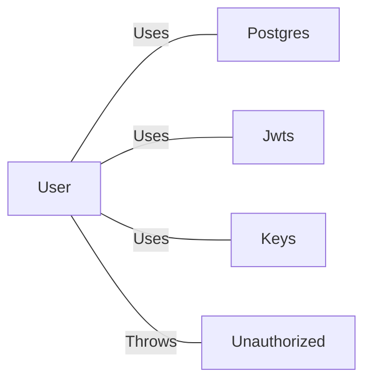

# User.java: User Authentication and Data Access Model

## Overview

This Java class represents a User entity that handles user authentication operations, including JWT (JSON Web Token) generation, token validation, and user data retrieval from a PostgreSQL database. The class combines data structure responsibilities with authentication logic.

## Process Flow

```mermaid
flowchart TD
    subgraph Token Generation
        A[Start token method] --> B[Generate HMAC SecretKey from secret]
        B --> C[Build JWT with username as subject]
        C --> D[Sign JWT with SecretKey]
        D --> E[Return compact JWT string]
    end

    subgraph Token Validation
        F[Start assertAuth] --> G[Generate HMAC SecretKey from secret]
        G --> H[Parse and validate JWT token]
        H --> I{Token Valid?}
        I -- Yes --> J[Return successfully]
        I -- No --> K[Throw Unauthorized exception]
    end

    subgraph User Fetch
        L[Start fetch method] --> M[Open database connection]
        M --> N[Build SQL query with username]
        N --> O[Execute query]
        O --> P{User found?}
        P -- Yes --> Q[Create User object]
        P -- No --> R[Return null]
        Q --> S[Close connection]
        S --> T[Return User object]
        R --> T
    end
```



## Insights

- The class serves dual purposes: data structure (user attributes) and service layer (authentication logic)
- JWT tokens use HMAC signing algorithm via the `io.jsonwebtoken` library
- Database connection handling includes basic exception logging but lacks proper resource cleanup in error scenarios
- The `fetch` method prints the SQL query to stdout, which could expose sensitive information in logs
- Connection closure occurs only in the success path, not in the exception handler

## Vulnerabilities

| Vulnerability | Severity | Location | Description |
|--------------|----------|----------|-------------|
| **SQL Injection** | Critical | `fetch()` method | User input (`un` parameter) is directly concatenated into the SQL query string without parameterization or sanitization. An attacker can inject arbitrary SQL commands. |
| **Credential Exposure** | High | `fetch()` method | The SQL query containing username is printed to stdout via `System.out.println(query)`, potentially exposing sensitive data in logs. |
| **Resource Leak** | Medium | `fetch()` method | Database connection and statement are not properly closed in exception scenarios. The `finally` block only returns without cleanup. |
| **Weak Exception Handling** | Medium | `assertAuth()` method | Generic exception catching masks specific JWT validation failures; stack trace printing may expose internal details. |
| **Insecure Token Secret** | Medium | `token()` / `assertAuth()` | Secret is passed as a string parameter and converted to bytes, suggesting it may be stored/transmitted insecurely. |

### SQL Injection Example

The vulnerable query construction:
```
"select * from users where username = '" + un + "' limit 1"
```

An attacker providing `admin' OR '1'='1' --` as username would bypass authentication.

## Dependencies



| Dependency | Description |
|------------|-------------|
| `Postgres` | Internal class providing database connection via `Postgres.connection()` |
| `Jwts` | JJWT library class for building and parsing JWT tokens |
| `Keys` | JJWT security utility for generating HMAC signing keys from byte arrays |
| `Unauthorized` | Custom exception class thrown when JWT validation fails |

## Data Manipulation (SQL)

| Entity | Operation | Description |
|--------|-----------|-------------|
| `users` | SELECT | Retrieves user record by username, fetching `userid`, `username`, and `password` columns |

### User Data Structure

| Attribute | Type | Description |
|-----------|------|-------------|
| `id` | String | Unique user identifier |
| `username` | String | User's login name |
| `hashedPassword` | String | Stored password hash for authentication |
