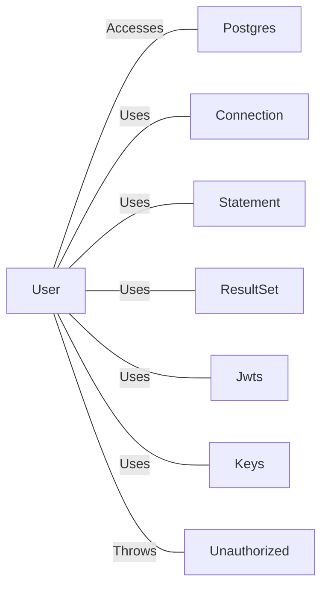

# User.java: User Authentication and Data Access Entity

## Overview

This class represents a User entity that handles user authentication operations including JWT token generation, token validation, and user retrieval from the database. It combines data structure responsibilities with authentication logic and database access functionality.

## Process Flow

```mermaid
graph TD
    subgraph Token Generation
        A[token method called] --> B[Generate HMAC Key from secret]
        B --> C[Build JWT with username as subject]
        C --> D[Sign and compact token]
        D --> E[Return JWT string]
    end

    subgraph Token Validation
        F[assertAuth called] --> G[Generate HMAC Key from secret]
        G --> H{Parse and validate token}
        H -- Valid --> I[Return successfully]
        H -- Invalid --> J[Throw Unauthorized exception]
    end

    subgraph User Fetch
        K[fetch called with username] --> L[Get database connection]
        L --> M[Build SQL query with username]
        M --> N[Execute query]
        N --> O{Results found?}
        O -- Yes --> P[Create User object]
        O -- No --> Q[Return null]
        P --> R[Close connection]
        Q --> R
        R --> S[Return User]
    end
```



## Insights

- User entity combines data model with business logic (violates Single Responsibility Principle)
- JWT implementation uses HMAC-SHA algorithm for token signing
- Database connection is obtained through a `Postgres` utility class
- Token generation embeds only the username as the JWT subject
- The `assertAuth` method validates tokens but does not return user information
- Connection management includes manual close operations within try-catch blocks

## Vulnerabilities

| Vulnerability | Severity | Location | Description |
|--------------|----------|----------|-------------|
| **SQL Injection** | Critical | `fetch()` method | User input (`un` parameter) is directly concatenated into SQL query without parameterization or sanitization |
| **Hardcoded SQL Comment** | High | `fetch()` method | Query contains `DROP DATABASE` text suggesting test/debug code or intentional vulnerability demonstration |
| **Exception Information Leakage** | Medium | `assertAuth()` method | Full exception message is passed to `Unauthorized` exception, potentially exposing internal details |
| **Weak Error Handling** | Medium | `fetch()` method | Exceptions are caught and printed but method continues execution, potentially returning null unexpectedly |
| **Resource Leak Risk** | Low | `fetch()` method | Connection may not be closed if exception occurs before `cxn.close()` call |

### SQL Injection Example

The vulnerable code:
```
String query = "select * from users where username = '" + un + "' limit 1"
```

An attacker could input: `' OR '1'='1` to bypass authentication.

## Dependencies



| Dependency | Description |
|------------|-------------|
| `Postgres` | Database connection provider; accessed via static `connection` property |
| `Connection` | JDBC connection interface for database operations |
| `Statement` | JDBC statement for executing SQL queries |
| `ResultSet` | JDBC result set for iterating query results |
| `Jwts` | JJWT library for JWT token building and parsing |
| `Keys` | JJWT utility for generating cryptographic keys from byte arrays |
| `Unauthorized` | Custom exception thrown when token validation fails |

## Data Manipulation (SQL)

| Entity | Operation | Description |
|--------|-----------|-------------|
| `users` | SELECT | Retrieves user record by username; fetches `user_id`, `username`, and `password` columns |

### User Entity Attributes

| Attribute | Type | Description |
|-----------|------|-------------|
| `id` | String | Unique user identifier |
| `username` | String | User's login name |
| `hashedPassword` | String | Stored password hash for authentication |
