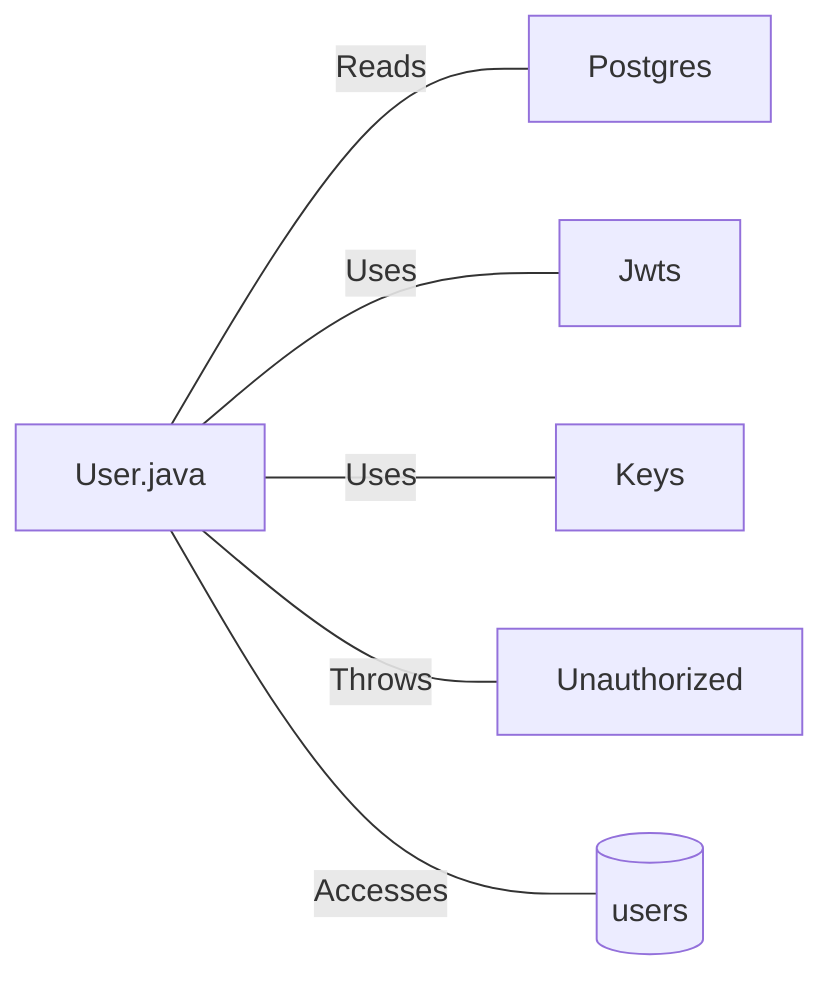

# User.java: Classe de Modelo e Autenticação de Usuário

## Overview

Esta classe representa a estrutura de dados de um usuário no sistema e fornece funcionalidades de autenticação baseada em JWT (JSON Web Token). A classe é responsável por:
- Armazenar dados do usuário (id, username, senha hash)
- Gerar tokens JWT para autenticação
- Validar tokens JWT
- Buscar usuários no banco de dados

## Process Flow

```mermaid
flowchart TD
    subgraph Geração_Token["Geração de Token"]
        A["token(secret)"] --> B["Criar SecretKey via HMAC"]
        B --> C["Construir JWT com username"]
        C --> D["Assinar e retornar token"]
    end

    subgraph Validação_Auth["Validação de Autenticação"]
        E["assertAuth(secret, token)"] --> F["Criar SecretKey"]
        F --> G{"Token válido?"}
        G --> |"Sim"| H["Continua execução"]
        G --> |"Não"| I["Lança Unauthorized"]
    end

    subgraph Busca_Usuario["Busca de Usuário"]
        J["fetch(username)"] --> K["Conectar ao PostgreSQL"]
        K --> L["Executar query SQL"]
        L --> M{"Usuário encontrado?"}
        M --> |"Sim"| N["Criar objeto User"]
        M --> |"Não"| O["Retorna null"]
        N --> P["Fechar conexão"]
        O --> P
    end
```



## Insights

- **VULNERABILIDADE CRÍTICA: SQL Injection** - O método `fetch()` concatena diretamente o parâmetro `un` na query SQL sem sanitização, permitindo ataques de injeção SQL
- **Comentário suspeito na query** - A string SQL contém `DROP DATABASE 1` como comentário/texto, indicando possível teste de vulnerabilidade ou código malicioso
- **Senha armazenada em memória** - A senha hash fica exposta como atributo público da classe
- **Tratamento de exceção genérico** - Utiliza `catch(Exception e)` que captura todas exceções, dificultando debug específico
- **Conexão não fechada em caso de erro** - O `cxn.close()` está fora do bloco try-catch, podendo causar vazamento de conexões

## Vulnerabilities

### 1. SQL Injection (Crítico)
```java
String query = "select * from users where username = '" + un + "' limit 1"
```
- **Risco**: Atacantes podem manipular a query para extrair, modificar ou deletar dados
- **Remediação**: Utilizar `PreparedStatement` com parâmetros

### 2. Exposição de Atributos Sensíveis
- Os atributos `id`, `username` e `hashedPassword` são públicos
- **Remediação**: Utilizar encapsulamento com modificador `private` e métodos getters

### 3. Gerenciamento de Recursos Inadequado
- Conexões de banco podem não ser fechadas em caso de exceção
- **Remediação**: Utilizar try-with-resources

### 4. Exposição de Stack Trace
- `e.printStackTrace()` expõe detalhes internos da aplicação
- **Remediação**: Utilizar logging apropriado sem exposição de detalhes sensíveis

## Dependencies



| Dependência | Descrição |
|-------------|-----------|
| `Postgres` | Classe utilitária para obter conexão com banco de dados PostgreSQL |
| `Jwts` | Biblioteca io.jsonwebtoken para criação e parsing de tokens JWT |
| `Keys` | Utilitário para geração de chaves criptográficas HMAC |
| `Unauthorized` | Exceção customizada lançada quando autenticação falha |

## Data Manipulation (SQL)

### Tabela: `users`

| Atributo | Tipo | Descrição |
|----------|------|-----------|
| `userid` | String | Identificador único do usuário |
| `username` | String | Nome de usuário para login |
| `password` | String | Hash da senha do usuário |

### Operações SQL

| Entidade | Operação | Descrição |
|----------|----------|-----------|
| `users` | SELECT | Busca registro de usuário pelo username com limite de 1 resultado |
