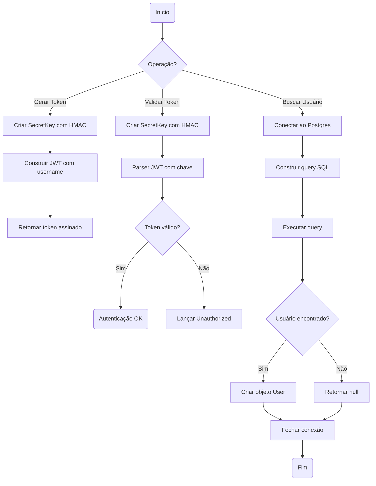
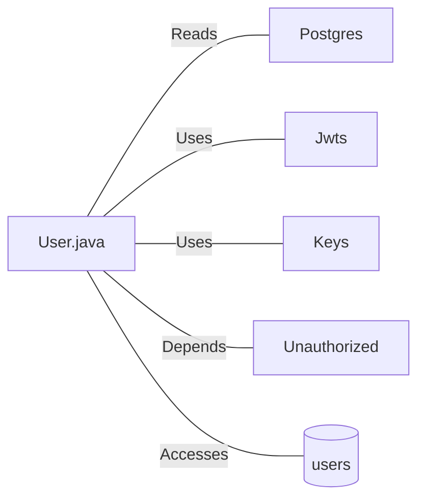

# User.java: Autenticação e Gerenciamento de Usuários

## Overview

Esta classe representa uma estrutura de dados de usuário com funcionalidades de autenticação baseada em JWT (JSON Web Token). Responsável por:
- Armazenar informações do usuário (id, username, senha hash)
- Gerar tokens JWT para autenticação
- Validar tokens de autorização
- Buscar usuários no banco de dados

## Process Flow



## Insights

- **Vulnerabilidade crítica de SQL Injection**: O método `fetch` concatena diretamente o parâmetro `un` na query SQL sem sanitização
- O comentário no código `DROP DATABASE` indica conhecimento da vulnerabilidade (possivelmente código de teste/demonstração)
- Utiliza biblioteca JJWT para geração e validação de tokens
- A senha é armazenada como hash (`hashedPassword`), seguindo boas práticas
- Tratamento de exceções genérico que expõe mensagens de erro internas
- Conexão com banco não utiliza try-with-resources, podendo causar vazamento de recursos

## Vulnerabilities

### 1. SQL Injection (Crítica)
```java
String query = "select * from users where username = '" + un + "' limit 1";
```
- **Impacto**: Permite execução arbitrária de comandos SQL
- **Risco**: Vazamento de dados, exclusão de tabelas, escalação de privilégios
- **Mitigação**: Utilizar PreparedStatement com parâmetros

### 2. Exposição de Informações em Exceções
- Stack traces são impressos no console
- Mensagens de erro são propagadas para camadas superiores
- **Mitigação**: Logging adequado e mensagens genéricas para usuários

### 3. Gerenciamento Inadequado de Recursos
- Conexões de banco não são fechadas em caso de exceção
- Statement não é fechado explicitamente
- **Mitigação**: Utilizar try-with-resources

## Dependencies



| Dependência | Descrição |
|-------------|-----------|
| `Postgres` | Classe interna que fornece conexão com banco de dados PostgreSQL |
| `Jwts` | Biblioteca io.jsonwebtoken para criação e parsing de tokens JWT |
| `Keys` | Utilitário para geração de chaves HMAC para assinatura de tokens |
| `Unauthorized` | Exceção customizada lançada quando autenticação falha |

## Data Manipulation (SQL)

| Entidade | Operação | Descrição |
|----------|----------|-----------|
| `users` | SELECT | Busca usuário por username, retornando userid, username e password |

### Estrutura da Tabela `users`

| Atributo | Tipo | Descrição |
|----------|------|-----------|
| `userid` | String | Identificador único do usuário |
| `username` | String | Nome de usuário para login |
| `password` | String | Senha do usuário (armazenada como hash) |
