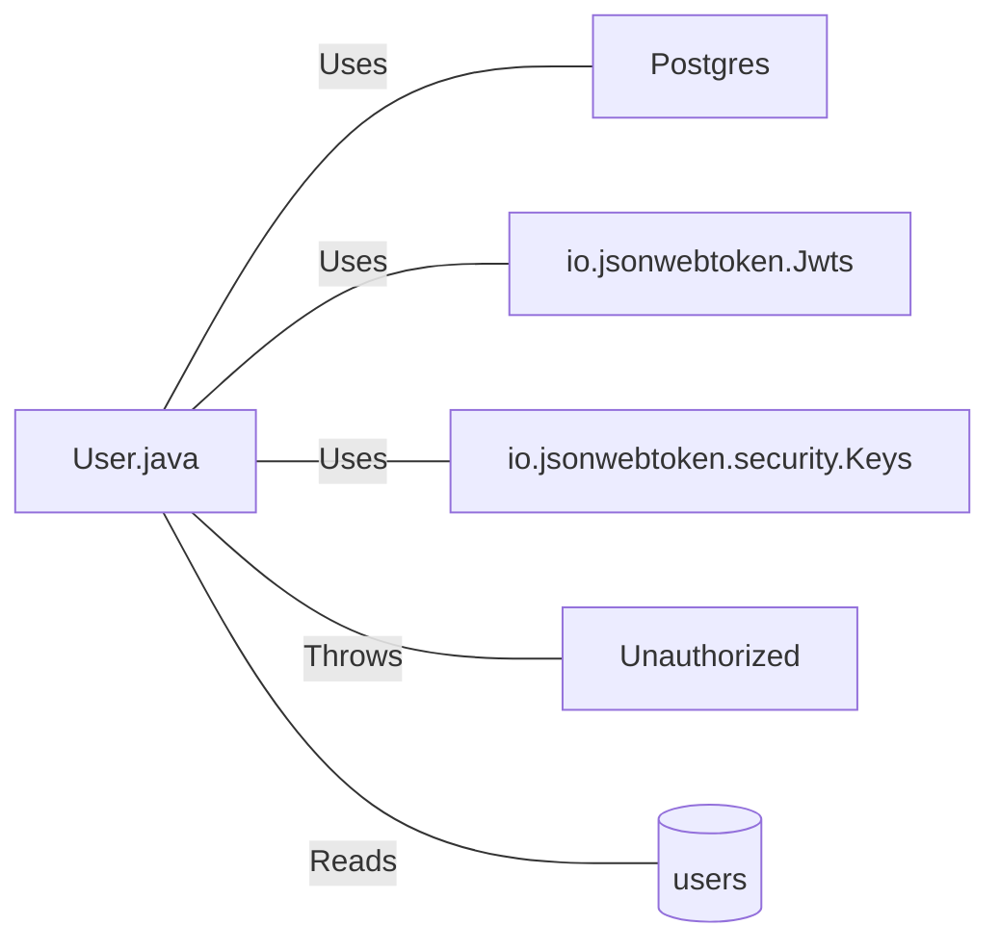

# User.java: Classe de Autenticação e Gerenciamento de Usuários

## Overview

Esta classe representa uma estrutura de dados de usuário com funcionalidades de autenticação baseada em JWT (JSON Web Tokens). Responsável por:
- Armazenar informações do usuário (id, username, senha hash)
- Gerar tokens JWT para autenticação
- Validar tokens de autenticação
- Buscar usuários no banco de dados

## Process Flow

```mermaid
flowchart TD
    subgraph Token_Generation["Geração de Token"]
        A1("Receber secret") --> A2["Criar SecretKey com HMAC"]
        A2 --> A3["Construir JWT com username"]
        A3 --> A4("Retornar token assinado")
    end
    
    subgraph Token_Validation["Validação de Token"]
        B1("Receber secret e token") --> B2["Criar SecretKey"]
        B2 --> B3["Parser JWT"]
        B3 --> B4{"Token válido?"}
        B4 --> |"Sim"| B5("Autenticação OK")
        B4 --> |"Não"| B6["Lançar Unauthorized"]
    end
    
    subgraph User_Fetch["Busca de Usuário"]
        C1("Receber username") --> C2["Abrir conexão DB"]
        C2 --> C3["Construir query SQL"]
        C3 --> C4["Executar query"]
        C4 --> C5{"Resultado encontrado?"}
        C5 --> |"Sim"| C6["Criar objeto User"]
        C5 --> |"Não"| C7["Retornar null"]
        C6 --> C8["Fechar conexão"]
        C7 --> C8
        C8 --> C9("Retornar User")
    end
```



## Insights

- **Vulnerabilidade Crítica de SQL Injection**: O método `fetch()` concatena diretamente o parâmetro `un` na query SQL sem sanitização
- A query SQL contém código malicioso comentado (`DROP DATABASE`) indicando um exemplo de ataque
- O token JWT utiliza apenas o username como subject, sem expiração definida
- O método `fetch()` retorna `null` silenciosamente em caso de erro, dificultando debugging
- A conexão com banco de dados é fechada dentro do bloco try, mas não há tratamento adequado no finally
- Exceções são apenas impressas no console sem tratamento adequado

## Vulnerabilities

### 1. SQL Injection (Crítica)
```java
String query = "select * from users where username = '" + un + "' limit 1";
```
- **Severidade**: Crítica
- **Descrição**: Input do usuário é concatenado diretamente na query SQL
- **Impacto**: Atacante pode extrair, modificar ou deletar dados do banco
- **Remediação**: Utilizar PreparedStatement com parâmetros

### 2. JWT sem Expiração
- **Severidade**: Média
- **Descrição**: Tokens gerados não possuem tempo de expiração (`exp` claim)
- **Impacto**: Tokens comprometidos permanecem válidos indefinidamente
- **Remediação**: Adicionar `.setExpiration()` na construção do JWT

### 3. Exposição de Informações de Erro
- **Severidade**: Baixa
- **Descrição**: Stack traces e mensagens de erro são impressos no console
- **Impacto**: Pode revelar informações sensíveis sobre a estrutura interna

### 4. Gerenciamento Inadequado de Recursos
- **Severidade**: Média
- **Descrição**: Conexão não é fechada em bloco finally apropriado
- **Impacto**: Possível vazamento de conexões de banco de dados

## Dependencies



| Dependência | Tipo | Descrição |
|-------------|------|-----------|
| `Postgres` | Classe interna | Fornece conexão com banco de dados via método `connection()` |
| `Unauthorized` | Exception | Exceção customizada lançada em falhas de autenticação |
| `io.jsonwebtoken.*` | Biblioteca externa | Biblioteca JJWT para criação e validação de tokens JWT |
| `javax.crypto.SecretKey` | JDK | Interface para chaves secretas criptográficas |

## Data Manipulation (SQL)

| Entidade | Operação | Descrição |
|----------|----------|-----------|
| `users` | SELECT | Busca um único usuário pelo username, retornando userid, username e password |

### Estrutura da Tabela `users`

| Atributo | Tipo | Descrição |
|----------|------|-----------|
| `userid` | String | Identificador único do usuário |
| `username` | String | Nome de usuário para login |
| `password` | String | Senha armazenada (hash) |
