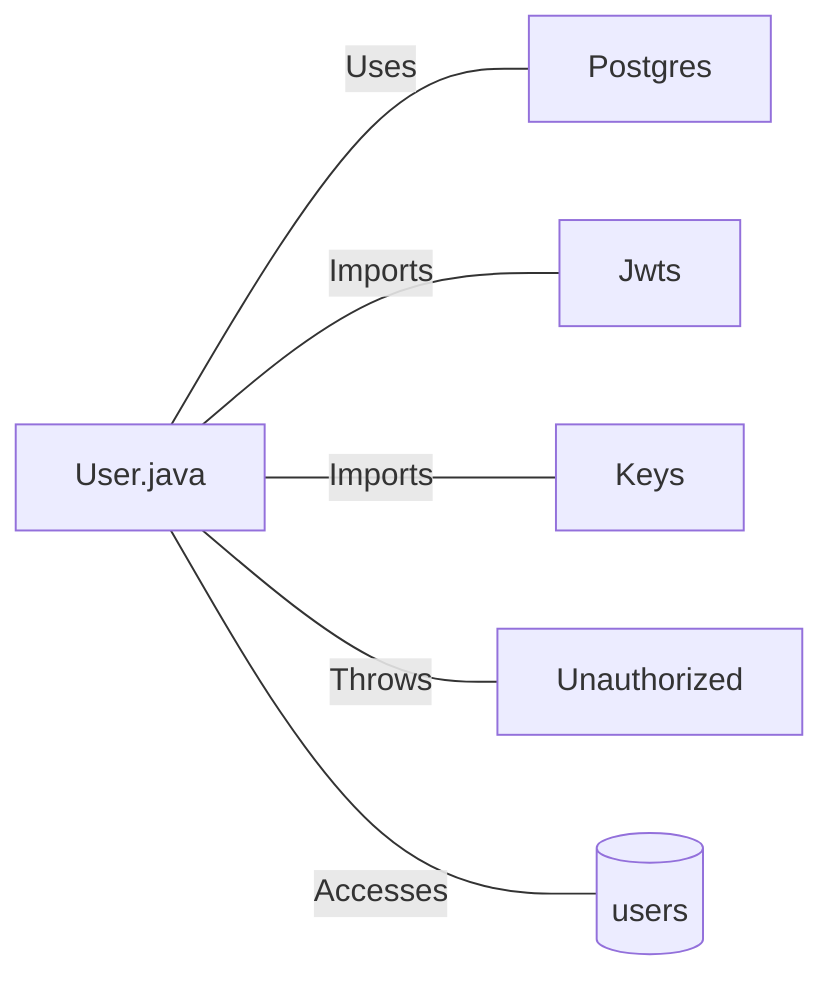

# User.java: User Authentication and Data Access Model

## Overview

This Java class represents a User entity that handles user authentication operations, including JWT (JSON Web Token) generation, token validation, and user data retrieval from a PostgreSQL database. The class combines data structure responsibilities with authentication logic.

## Process Flow

```mermaid
graph TD
    subgraph Token Generation
        A[Start token method] --> B[Generate HMAC key from secret]
        B --> C[Build JWT with username as subject]
        C --> D[Sign and compact token]
        D --> E[Return JWT string]
    end

    subgraph Token Validation
        F[Start assertAuth] --> G[Generate HMAC key from secret]
        G --> H[Parse and validate JWT]
        H --> I{Valid token?}
        I -- Yes --> J[Continue execution]
        I -- No --> K[Throw Unauthorized exception]
    end

    subgraph User Fetch
        L[Start fetch method] --> M[Open database connection]
        M --> N[Build SQL query with username]
        N --> O[Execute query]
        O --> P{Results found?}
        P -- Yes --> Q[Create User object]
        P -- No --> R[Return null]
        Q --> S[Close connection]
        S --> T[Return User]
        R --> T
    end
```

## Insights

- The class serves dual purposes: data structure (User entity) and service layer (authentication/database operations)
- JWT tokens use HMAC-SHA algorithm for signing via the `io.jsonwebtoken` library
- The `assertAuth` method validates tokens and throws custom `Unauthorized` exceptions for invalid tokens
- Database queries are logged to standard output, which may expose sensitive information
- The `fetch` method uses a static approach for database interaction rather than dependency injection

## Vulnerabilities

| Vulnerability | Severity | Location | Description |
|---------------|----------|----------|-------------|
| **SQL Injection** | Critical | `fetch()` method | User input (`un` parameter) is directly concatenated into the SQL query without sanitization or prepared statements. An attacker could inject malicious SQL code to access, modify, or delete database contents. |
| **Hardcoded SQL Comment Injection** | Critical | `fetch()` method | The query string contains `-- 1 DROP DATABASE 1` which appears to be a comment but demonstrates dangerous SQL injection patterns in the codebase. |
| **Sensitive Data Logging** | Medium | `fetch()` method | SQL queries containing user data are printed to stdout via `System.out.println(query)`, potentially exposing sensitive information in logs. |
| **Weak Exception Handling** | Low | `assertAuth()` method | Stack traces are printed to stderr, potentially revealing internal implementation details to attackers. |
| **Resource Leak Risk** | Low | `fetch()` method | The `Statement` and `ResultSet` objects are not explicitly closed in a finally block, potentially causing resource leaks. |

## Dependencies

| Dependency | Description |
|------------|-------------|
| `Postgres` | Database connection provider; accessed via `Postgres.connection()` static method |
| `Jwts` | JWT builder and parser from `io.jsonwebtoken` library; used for token creation and validation |
| `Keys` | Cryptographic key generator from `io.jsonwebtoken.security`; generates HMAC keys from secret bytes |
| `Unauthorized` | Custom exception class; thrown when JWT validation fails |

## Data Manipulation (SQL)

### User Entity Attributes

| Attribute | Type | Description |
|-----------|------|-------------|
| `id` | String | Unique identifier for the user |
| `username` | String | User's login name |
| `hashedPassword` | String | Stored password hash |

### Database Operations

| Entity | Operation | Description |
|--------|-----------|-------------|
| `users` | SELECT | Retrieves a single user record by username, selecting all columns (`user_id`, `username`, `password`) |
