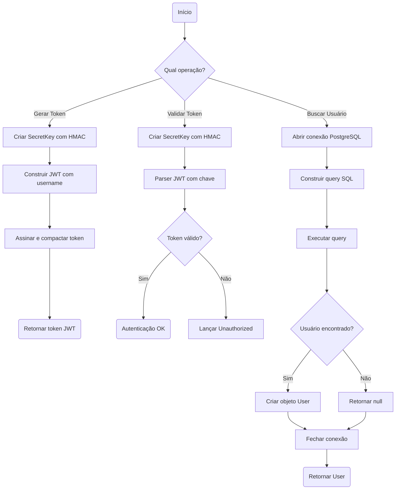
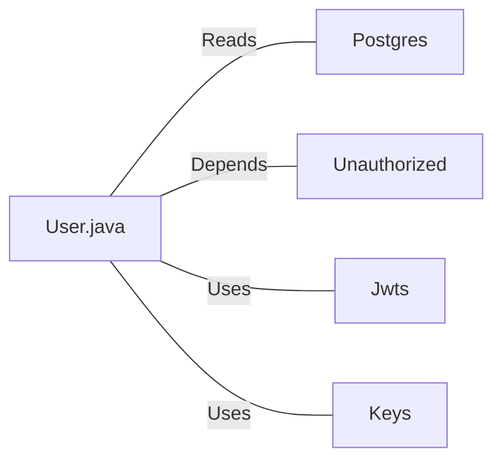

# User.java: Classe de Modelo de Usuário com Autenticação JWT

## Overview

Esta classe representa a estrutura de dados de um usuário no sistema, implementando funcionalidades de autenticação baseada em JWT (JSON Web Token). A classe é responsável por:
- Armazenar dados do usuário (id, username, password hash)
- Gerar tokens JWT para autenticação
- Validar tokens JWT
- Buscar usuários no banco de dados

## Process Flow



## Insights

- **Vulnerabilidade Crítica de SQL Injection**: O método `fetch()` concatena diretamente o parâmetro `un` na query SQL sem sanitização
- A query SQL contém um comentário suspeito (`DROP DATABASE`) indicando possível código de teste ou exemplo de ataque
- O método `assertAuth` utiliza tratamento de exceção genérico, capturando `Exception` ao invés de exceções específicas
- A conexão com o banco é fechada dentro do bloco `try`, podendo não ser fechada em caso de exceção
- O bloco `finally` contém um `return`, o que pode mascarar exceções
- Utiliza a biblioteca `io.jsonwebtoken` para manipulação de tokens JWT

## Vulnerabilities

### 1. SQL Injection (Crítica)
```java
String query = "select * from users where username = '" + un + "' limit 1"
```
- **Severidade**: Crítica
- **Descrição**: O parâmetro `un` é concatenado diretamente na query SQL, permitindo injeção de código malicioso
- **Impacto**: Um atacante pode extrair, modificar ou deletar dados do banco
- **Mitigação**: Usar `PreparedStatement` com parâmetros vinculados

### 2. Exposição de Informações Sensíveis
- Senhas (mesmo hasheadas) são carregadas e armazenadas no objeto User
- Stack traces são impressos no console (`e.printStackTrace()`)

### 3. Gerenciamento Inadequado de Recursos
- Conexão pode não ser fechada em cenários de exceção
- O `Statement` nunca é explicitamente fechado

### 4. Tratamento de Exceção Genérico
- Captura `Exception` genérica ao invés de exceções específicas do JWT

## Dependencies



| Dependência | Descrição |
|-------------|-----------|
| `Postgres` | Classe utilitária para obter conexão com banco de dados PostgreSQL |
| `Unauthorized` | Exceção customizada lançada quando autenticação falha |
| `Jwts` | Biblioteca JJWT para criação e parsing de tokens JWT |
| `Keys` | Utilitário JJWT para geração de chaves criptográficas HMAC |

## Data Manipulation (SQL)

| Entidade | Operação | Descrição |
|----------|----------|-----------|
| `users` | SELECT | Busca um usuário pelo username, retornando userid, username e password. Limitado a 1 registro |

### Estrutura da Tabela `users` (inferida)

| Atributo | Tipo Inferido | Descrição |
|----------|---------------|-----------|
| `userid` | String | Identificador único do usuário |
| `username` | String | Nome de usuário para login |
| `password` | String | Hash da senha do usuário |
