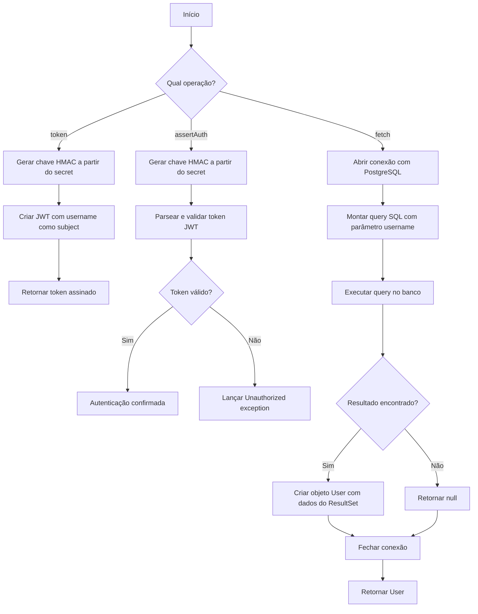
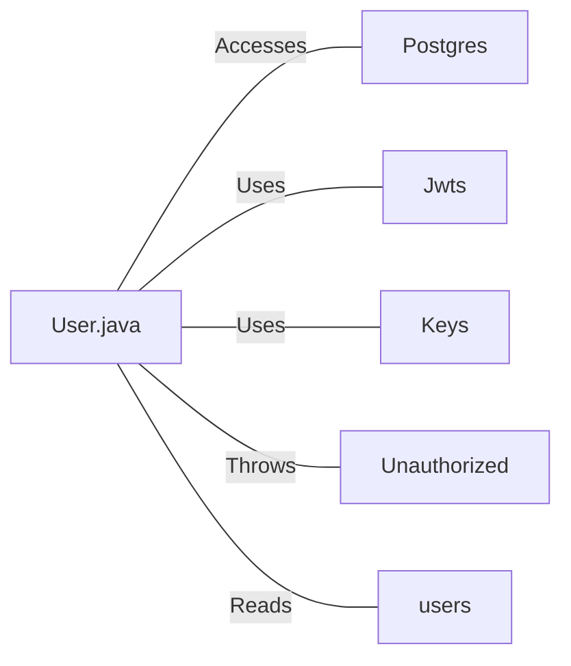

# User.java: Modelo de Usuário com Autenticação JWT e Acesso a Dados

## Overview

Esta classe representa a entidade de usuário do sistema, combinando três responsabilidades: estrutura de dados do usuário, geração/validação de tokens JWT para autenticação e busca de usuários no banco de dados. A classe interage diretamente com o banco de dados PostgreSQL e utiliza a biblioteca JJWT para manipulação de tokens.

## Process Flow


```mermaid
graph TD
    A[Início] --> B{Qual operação?}
    B -- token --> C[Gerar chave HMAC a partir do secret]
    C --> D[Criar JWT com username como subject]
    D --> E[Retornar token assinado]

    B -- assertAuth --> F[Gerar chave HMAC a partir do secret]
    F --> G[Parsear e validar token JWT]
    G --> H{Token válido?}
    H -- Sim --> I[Autenticação confirmada]
    H -- Não --> J[Lançar Unauthorized exception]

    B -- fetch --> K[Abrir conexão com PostgreSQL]
    K --> L[Montar query SQL com parâmetro username]
    L --> M[Executar query no banco]
    M --> N{Resultado encontrado?}
    N -- Sim --> O[Criar objeto User com dados do ResultSet]
    N -- Não --> P[Retornar null]
    O --> Q[Fechar conexão]
    P --> Q
    Q --> R[Retornar User]
```

## Vulnerabilities

### 1. SQL Injection Crítica
O método `fetch` concatena diretamente o parâmetro `un` na query SQL sem qualquer sanitização ou uso de `PreparedStatement`. Um atacante pode injetar SQL arbitrário através do campo de username.

**Trecho problemático:**
```
"select * from users where username = '" + un + "' limit 1"
```

### 2. SQL Injection Destrutiva Embutida
A própria query contém um comando `DELETE FROM USERS` concatenado na string SQL, o que pode resultar na exclusão de todos os registros da tabela `users` quando executado.

### 3. Segredo JWT Potencialmente Fraco
O segredo para assinatura JWT é recebido como `String` e convertido para bytes. Se o segredo fornecido for curto ou previsível, tokens podem ser forjados por atacantes.

### 4. Senhas Armazenadas sem Verificação de Hash Seguro
O campo `hashedPassword` é armazenado como texto simples no objeto, e não há evidência de uso de algoritmo de hash seguro (como bcrypt) para comparação de senhas.

### 5. Exposição de Informações Sensíveis
- A query SQL completa é impressa no `stdout` via `System.out.println`, podendo expor dados sensíveis em logs.
- O stack trace de exceções é impresso, podendo revelar detalhes internos da aplicação.

### 6. Gerenciamento Inadequado de Recursos
A conexão com o banco de dados não é fechada no bloco `finally`, sendo fechada apenas no fluxo de sucesso. Em caso de exceção, a conexão pode vazar.

## Insights

- A classe viola o princípio de responsabilidade única ao acumular modelo de dados, lógica de autenticação e acesso a banco
- O bloco `finally` contém apenas `return user`, sem garantir o fechamento da conexão ou do statement
- O método `fetch` é estático e depende diretamente da classe `Postgres` para obtenção de conexões
- A exceção `Unauthorized` é uma classe customizada utilizada para sinalizar falhas de autenticação
- Não há validação dos parâmetros de entrada em nenhum dos métodos

## Dependencies


```mermaid
graph LR
    User.java --- |"Accesses"| Postgres
    User.java --- |"Uses"| Jwts
    User.java --- |"Uses"| Keys
    User.java --- |"Throws"| Unauthorized
    User.java --- |"Reads"| users
```

| Dependência | Descrição |
|---|---|
| `Postgres` | Classe utilitária utilizada para obter a conexão JDBC com o banco de dados PostgreSQL via `Postgres.connection()` |
| `Jwts` | Classe da biblioteca JJWT utilizada para construir (`builder`), assinar e parsear tokens JWT |
| `Keys` | Classe da biblioteca JJWT utilizada para gerar chaves HMAC a partir de bytes do segredo |
| `Unauthorized` | Classe de exceção customizada lançada quando a validação do token JWT falha |
| `users` | Tabela do banco de dados que armazena os registros de usuários (colunas: `user_id`, `username`, `password`) |

## Data Manipulation (SQL)

| Entidade | Operação | Descrição |
|---|---|---|
| `users` | SELECT | Busca um único registro de usuário filtrando pelo campo `username` com `LIMIT 1` |
| `users` | DELETE | Comando `DELETE FROM users` embutido na string da query — remove todos os registros da tabela (comportamento destrutivo, possivelmente não intencional ou injetado como exemplo de vulnerabilidade) |

### Estrutura da Tabela `users`

| Coluna | Tipo (inferido) | Descrição |
|---|---|---|
| `user_id` | String | Identificador único do usuário |
| `username` | String | Nome de usuário utilizado para login e como subject do JWT |
| `password` | String | Hash da senha do usuário |
