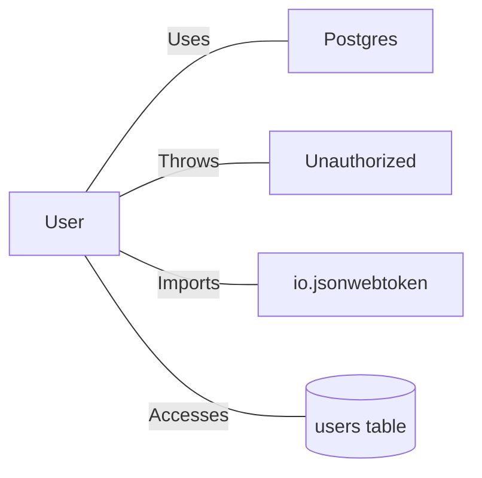

# User.java: User Authentication and Database Access Model

## Overview

This class represents a User entity that provides authentication functionality including JWT (JSON Web Token) generation and validation, as well as database operations for user retrieval. It serves as a core security component handling user credentials and token-based authentication.

## Process Flow


```mermaid
graph TD
    subgraph Token Generation
        A[token method called] --> B[Generate HMAC Key from secret]
        B --> C[Build JWT with username as subject]
        C --> D[Sign and compact JWT]
        D --> E[Return JWT string]
    end

    subgraph Token Validation
        F[assertAuth method called] --> G[Generate HMAC Key from secret]
        G --> H[Parse and validate JWT]
        H --> I{Token Valid?}
        I -- Yes --> J[Return successfully]
        I -- No --> K[Throw Unauthorized exception]
    end

    subgraph User Fetch
        L[fetch method called with username] --> M[Open database connection]
        M --> N[Build SQL query with username]
        N --> O[Execute query]
        O --> P{User found?}
        P -- Yes --> Q[Create User object]
        P -- No --> R[Return null]
        Q --> S[Close connection]
        R --> S
        S --> T[Return User object]
    end
```

## Insights

- **SQL Injection Vulnerability**: The `fetch` method concatenates user input directly into SQL query without parameterization
- **Sensitive Data Exposure**: Password hash is printed to console via `System.out.println`
- **Resource Leak Risk**: Database statement is never explicitly closed; only connection closure is attempted
- **Error Handling**: Stack traces are printed to console, potentially exposing system information
- **Static Methods**: Authentication and fetch operations are implemented as static utility methods

## Vulnerabilities

### Critical: SQL Injection (CWE-89)
The `fetch` method constructs SQL queries using string concatenation:
```java
String query = "select * from users where username = '" + un + "' limit 1"
```
An attacker can inject malicious SQL code through the `username` parameter to bypass authentication, extract sensitive data, or modify database contents.

### High: Sensitive Information Exposure (CWE-532)
The hashed password is logged to standard output:
```java
System.out.println(password)
```
This exposes credential information in logs that may be accessible to unauthorized parties.

### Medium: Information Disclosure via Error Messages (CWE-209)
Exception details are passed directly to the `Unauthorized` exception and stack traces are printed, potentially revealing internal system information to attackers.

### Low: Improper Resource Management (CWE-404)
The `Statement` object is never closed, which can lead to resource exhaustion under heavy load.

## Dependencies


```mermaid
flowchart LR
    User --- |"Uses"| Postgres
    User --- |"Throws"| Unauthorized
    User --- |"Imports"| JJWT[io.jsonwebtoken]
    User --- |"Accesses"| users[(users table)]
```

| Dependency | Nature | Description |
|------------|--------|-------------|
| `Postgres` | Uses | Obtains database connection for user queries |
| `Unauthorized` | Throws | Custom exception thrown when JWT validation fails |
| `io.jsonwebtoken` | Imports | JWT library for token creation and parsing |
| `Keys` | Imports | Provides HMAC key generation for JWT signing |

## Data Manipulation (SQL)

### User Entity Attributes

| Attribute | Type | Description |
|-----------|------|-------------|
| `id` | String | Unique user identifier |
| `username` | String | User login name |
| `hashedPassword` | String | Stored password hash |

### Database Operations

| Entity | Operation | Description |
|--------|-----------|-------------|
| `users` | SELECT | Retrieves a single user record by username, fetching userid, username, and password columns |
