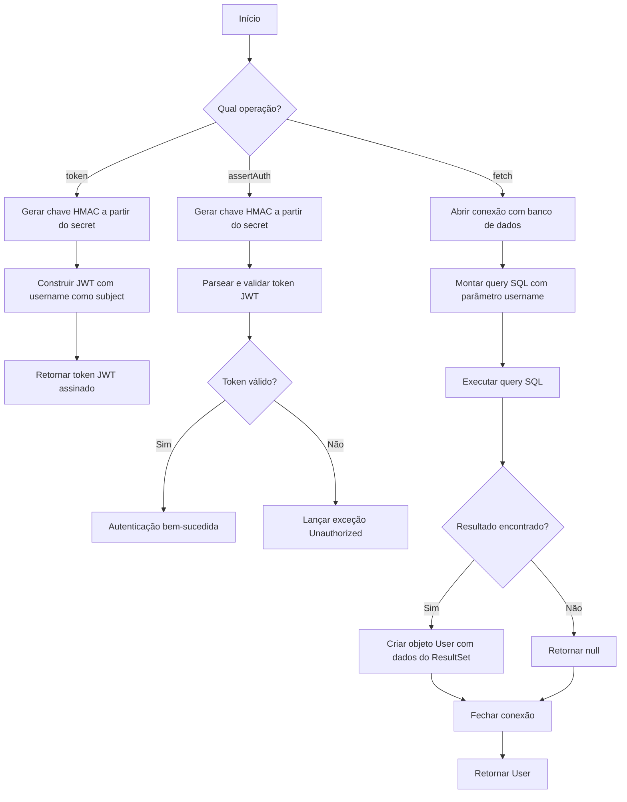
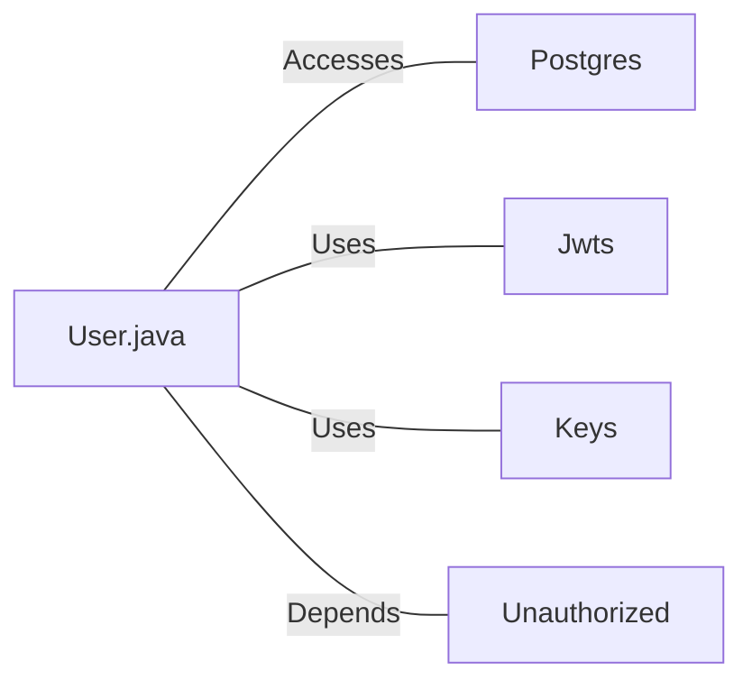

# User.java: Gerenciamento de Usuários com Autenticação JWT

## Overview

Estrutura de dados e classe de lógica responsável por representar um usuário no sistema, realizar autenticação via tokens JWT (JSON Web Tokens) e buscar dados de usuários no banco de dados PostgreSQL.

## Process Flow


```mermaid
graph TD
    A[Início] --> B{Qual operação?}
    B -- token --> C[Gerar chave HMAC a partir do secret]
    C --> D[Construir JWT com username como subject]
    D --> E[Retornar token JWT assinado]

    B -- assertAuth --> F[Gerar chave HMAC a partir do secret]
    F --> G[Parsear e validar token JWT]
    G --> H{Token válido?}
    H -- Sim --> I[Autenticação bem-sucedida]
    H -- Não --> J[Lançar exceção Unauthorized]

    B -- fetch --> K[Abrir conexão com banco de dados]
    K --> L[Montar query SQL com parâmetro username]
    L --> M[Executar query SQL]
    M --> N{Resultado encontrado?}
    N -- Sim --> O[Criar objeto User com dados do ResultSet]
    N -- Não --> P[Retornar null]
    O --> Q[Fechar conexão]
    Q --> R[Retornar User]
    P --> Q
```

## Insights

- **Injeção de SQL (SQL Injection):** O método `fetch` concatena diretamente o parâmetro `un` na query SQL sem qualquer sanitização ou uso de `PreparedStatement`, permitindo ataques de SQL Injection.
- **SQL destrutivo embutido:** A string da query contém literalmente `DELETE FROM USERS` concatenado ao final do `SELECT`, o que pode causar exclusão total dos registros da tabela `users` dependendo do driver e modo de execução.
- **Gerenciamento de conexão frágil:** O `Statement` nunca é fechado explicitamente, e a conexão é fechada apenas no caminho de sucesso (dentro do `try`), podendo causar vazamento de recursos em caso de exceção.
- **Segredo JWT recebido como parâmetro String:** A chave de assinatura é derivada diretamente dos bytes da string `secret`, sem validação de tamanho mínimo ou complexidade, o que pode fragilizar a segurança do token.
- **Impressão de stack trace em produção:** Exceções são tratadas com `e.printStackTrace()` e `System.err.println`, expondo informações internas do sistema.
- **Retorno de `null` silencioso:** O método `fetch` retorna `null` tanto em caso de usuário não encontrado quanto em caso de erro, dificultando a diferenciação entre os cenários.

## Vulnerabilidades

### 1. SQL Injection Crítica
O método `fetch` constrói a query via concatenação de string:
```
"select * from users where username = '" + un + "' limit 1"
```
Um atacante pode manipular o parâmetro `un` para executar qualquer comando SQL arbitrário no banco de dados.

### 2. Comando DELETE embutido na query
A query contém `DELETE FROM USERS` concatenado ao final do `SELECT`. Isso representa uma ameaça direta de destruição de dados, pois pode excluir todos os registros da tabela `users`.

### 3. Exposição de informações sensíveis
Stack traces completos são impressos via `e.printStackTrace()`, podendo revelar detalhes internos da aplicação (caminhos de arquivo, estrutura de pacotes, drivers utilizados).

### 4. Tratamento inadequado de exceções na autenticação
No método `assertAuth`, a mensagem da exceção original é repassada ao construtor de `Unauthorized`, potencialmente expondo detalhes internos ao cliente.

## Dependencies


```mermaid
graph LR
    User.java --- |"Accesses"| Postgres
    User.java --- |"Uses"| Jwts
    User.java --- |"Uses"| Keys
    User.java --- |"Depends"| Unauthorized
```

| Dependência | Descrição |
|---|---|
| `Postgres` | Acessa `Postgres.connection()` para obter uma conexão JDBC com o banco de dados |
| `Jwts` | Utiliza `Jwts.builder()` para criação de tokens JWT e `Jwts.parser()` para validação |
| `Keys` | Utiliza `Keys.hmacShaKeyFor()` para gerar a chave HMAC a partir de bytes do secret |
| `Unauthorized` | Exceção customizada lançada quando a validação do token JWT falha |

## Data Manipulation (SQL)

### Estrutura da Classe `User`

| Atributo | Tipo | Descrição |
|---|---|---|
| `id` | `String` | Identificador único do usuário |
| `username` | `String` | Nome de usuário |
| `hashedPassword` | `String` | Hash da senha do usuário |

### Operações SQL

| Entidade | Operação | Descrição |
|---|---|---|
| `users` | `SELECT` | Busca um registro de usuário pelo campo `username` com limite de 1 resultado |
| `users` | `DELETE` | Comando `DELETE FROM USERS` embutido na string da query — remove todos os registros da tabela (potencialmente destrutivo e possivelmente não intencional) |
