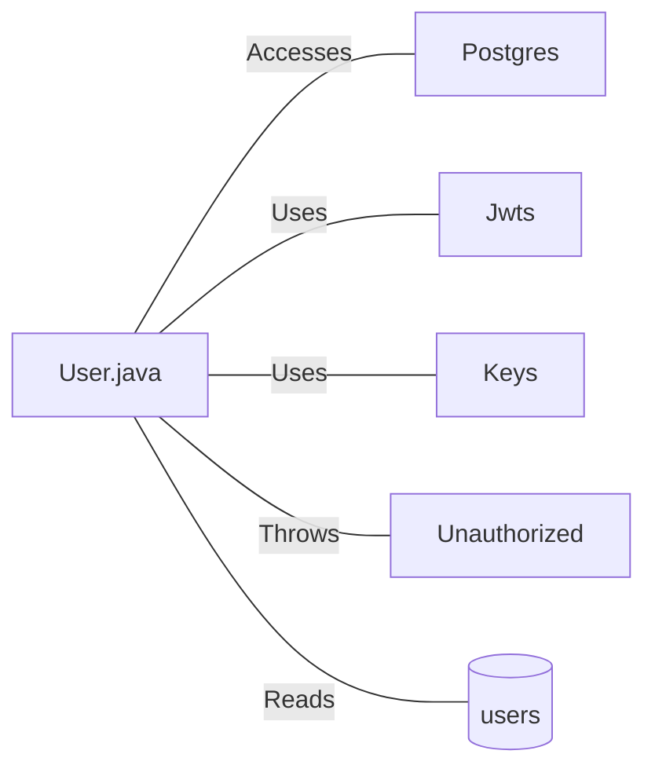

# User.java: User Authentication and Data Access Model

## Overview

This class represents a User entity that handles user authentication operations including JWT token generation, token validation, and user data retrieval from a PostgreSQL database. It serves as both a data structure for user information and contains static methods for authentication-related operations.

## Process Flow


```mermaid
graph TD
    subgraph Token Generation
        A[token method called] --> B[Generate HMAC Key from secret]
        B --> C[Build JWT with username as subject]
        C --> D[Sign and return compact JWT]
    end

    subgraph Token Validation
        E[assertAuth called] --> F[Generate HMAC Key from secret]
        F --> G{Parse and validate JWT}
        G -- Valid --> H[Return successfully]
        G -- Invalid --> I[Print stack trace]
        I --> J[Throw Unauthorized exception]
    end

    subgraph User Fetch
        K[fetch called with username] --> L[Get database connection]
        L --> M[Build SQL query with username]
        M --> N[Execute query]
        N --> O{Results found?}
        O -- Yes --> P[Create User object]
        O -- No --> Q[Return null]
        P --> R[Close connection]
        R --> S[Return User]
        Q --> R
    end
```

## Insights

- The `fetch` method contains a **critical SQL injection vulnerability** - user input is directly concatenated into the SQL query
- JWT implementation uses HMAC-SHA for signing tokens with a provided secret
- The class mixes data model responsibilities with authentication logic (violates Single Responsibility Principle)
- Database connection is obtained from a `Postgres` utility class
- Token validation throws a custom `Unauthorized` exception on failure
- The `finally` block contains a return statement, which is a code smell that can mask exceptions

## Vulnerabilities

| Vulnerability | Severity | Location | Description |
|--------------|----------|----------|-------------|
| **SQL Injection** | Critical | `fetch()` method | User input (`un` parameter) is directly concatenated into SQL query without sanitization or parameterization. Attackers can inject malicious SQL to bypass authentication or extract data. |
| **Information Disclosure** | Medium | `assertAuth()` method | Exception messages are passed directly to the `Unauthorized` exception, potentially exposing internal system details. |
| **Weak Error Handling** | Low | `fetch()` method | Stack traces are printed to stderr, which may expose sensitive information in production environments. |
| **Resource Leak Risk** | Low | `fetch()` method | Statement object is never explicitly closed; relies only on connection close. |

### SQL Injection Example

The vulnerable code:
```
String query = "select * from users where username = '" + un + "' limit 1"
```

An attacker could provide input like: `' OR '1'='1` to bypass authentication.

## Dependencies


```mermaid
flowchart LR
    User.java --- |"Accesses"| Postgres
    User.java --- |"Uses"| Jwts
    User.java --- |"Uses"| Keys
    User.java --- |"Throws"| Unauthorized
    User.java --- |"Reads"| users_table[(users)]
```

| Dependency | Description |
|------------|-------------|
| `Postgres` | Database connection provider; `connection()` method returns active database connection |
| `Jwts` | JJWT library for JWT token building and parsing operations |
| `Keys` | JJWT security utility for generating HMAC signing keys from byte arrays |
| `Unauthorized` | Custom exception class thrown when token validation fails |
| `users` | Database table containing user credentials |

## Data Manipulation (SQL)

### User Entity Attributes

| Attribute | Type | Description |
|-----------|------|-------------|
| `id` | String | Unique user identifier |
| `username` | String | User login name |
| `hashedPassword` | String | Stored password hash |

### Database Operations

| Entity | Operation | Description |
|--------|-----------|-------------|
| `users` | SELECT | Retrieves user record by username with limit of 1 result; fetches userid, username, and password columns |
