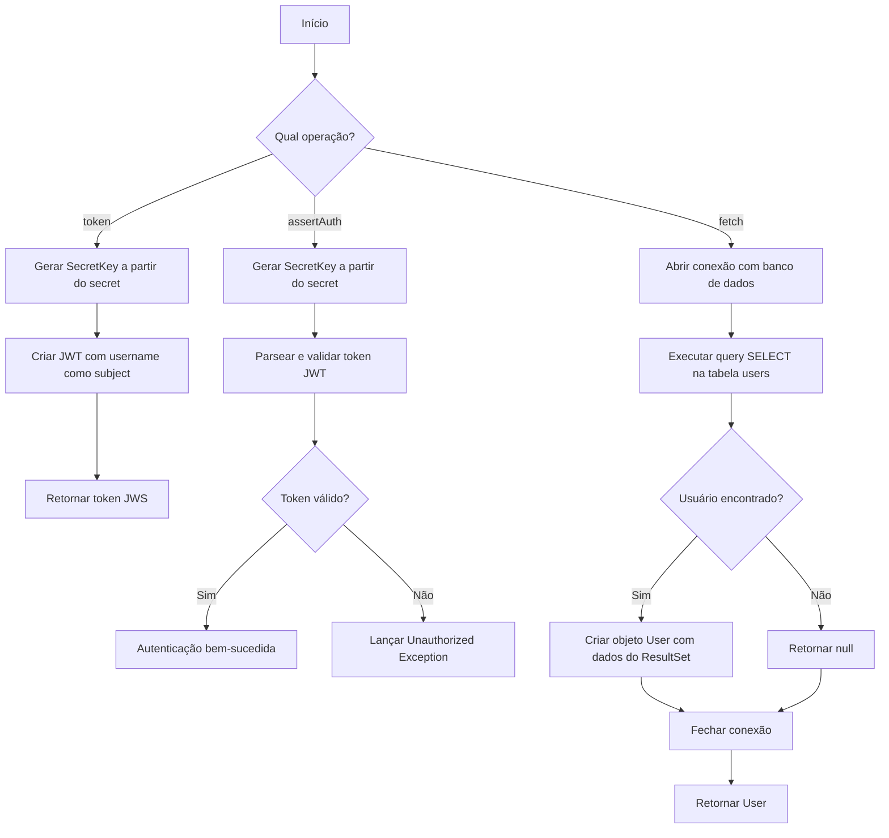
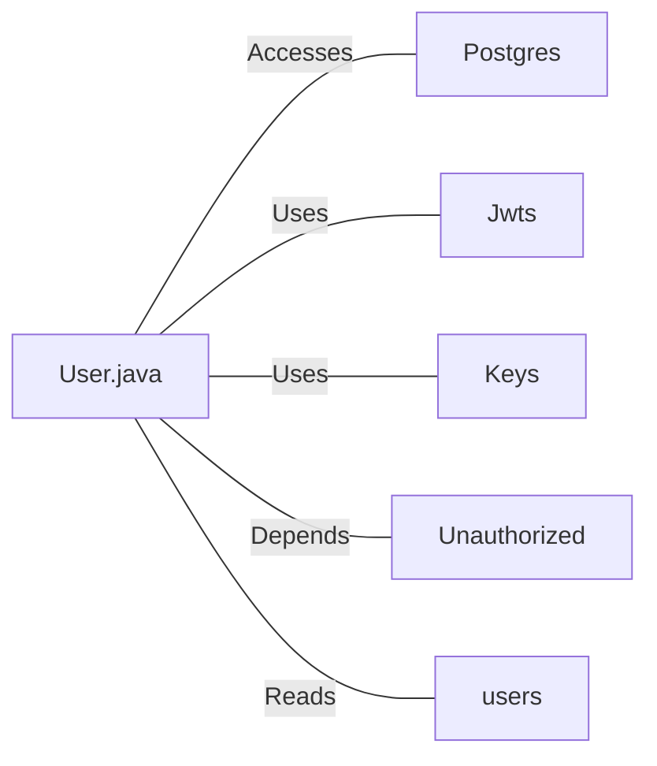

# User.java: Gerenciamento de Usuários com Autenticação JWT

## Overview

Estrutura de dados e classe utilitária responsável por representar um usuário no sistema, oferecendo funcionalidades de:
- Geração de tokens JWT
- Validação de autenticação via JWT
- Busca de usuários no banco de dados

## Process Flow


```mermaid
graph TD
    A[Início] --> B{Qual operação?}
    B -- token --> C[Gerar SecretKey a partir do secret]
    C --> D[Criar JWT com username como subject]
    D --> E[Retornar token JWS]

    B -- assertAuth --> F[Gerar SecretKey a partir do secret]
    F --> G[Parsear e validar token JWT]
    G --> H{Token válido?}
    H -- Sim --> I[Autenticação bem-sucedida]
    H -- Não --> J[Lançar Unauthorized Exception]

    B -- fetch --> K[Abrir conexão com banco de dados]
    K --> L[Executar query SELECT na tabela users]
    L --> M{Usuário encontrado?}
    M -- Sim --> N[Criar objeto User com dados do ResultSet]
    M -- Não --> O[Retornar null]
    N --> P[Fechar conexão]
    O --> P
    P --> Q[Retornar User]
```

## Insights

- **Injeção de SQL crítica**: O método `fetch` concatena diretamente o parâmetro `un` na query SQL sem sanitização ou uso de `PreparedStatement`, permitindo SQL Injection
- **Exposição de informações sensíveis**: Queries SQL e dados do resultado são impressos no console via `System.out.println`, o que pode vazar informações em ambientes de produção
- **Gerenciamento de conexão inadequado**: A conexão é fechada apenas no fluxo de sucesso; o bloco `finally` contém apenas o `return`, sem garantir o fechamento da conexão em caso de exceção
- **O `Statement` nunca é fechado explicitamente**, podendo causar vazamento de recursos
- **O método `assertAuth` imprime o stack trace** da exceção antes de lançar `Unauthorized`, o que pode expor detalhes internos da aplicação
- A senha é armazenada como hash (`hashedPassword`), mas é carregada integralmente do banco de dados sem restrição de uso posterior

## Vulnerabilidades

### 1. SQL Injection (Crítica)
O método `fetch` constrói a query SQL por concatenação de string:
```
"select * from users where username = '" + un + "' limit 1"
```
Um atacante pode manipular o parâmetro `un` para executar comandos SQL arbitrários. **Correção**: utilizar `PreparedStatement` com parâmetros vinculados.

### 2. Vazamento de Informações via Logs
Queries SQL completas e resultados são impressos no console (`System.out.println`), expondo estrutura do banco e dados sensíveis.

### 3. Gerenciamento Inseguro de Exceções
O stack trace é impresso diretamente em `assertAuth` e `fetch`, podendo revelar detalhes internos da aplicação a um atacante.

### 4. Vazamento de Recursos (Resource Leak)
A conexão e o `Statement` não são fechados em cenários de exceção, podendo esgotar o pool de conexões do banco.

## Dependencies


```mermaid
flowchart LR
    User.java --- |"Accesses"| Postgres
    User.java --- |"Uses"| Jwts
    User.java --- |"Uses"| Keys
    User.java --- |"Depends"| Unauthorized
    User.java --- |"Reads"| users
```

| Dependência | Descrição |
|---|---|
| `Postgres` | Classe interna utilizada para obter a conexão JDBC com o banco de dados via `Postgres.connection()` |
| `Jwts` | Biblioteca `io.jsonwebtoken` utilizada para construção (`builder`) e parsing (`parser`) de tokens JWT |
| `Keys` | Classe utilitária de `io.jsonwebtoken.security` para gerar `SecretKey` HMAC a partir de bytes do secret |
| `Unauthorized` | Exceção customizada lançada quando a validação do token JWT falha em `assertAuth` |
| `users` | Tabela do banco de dados consultada via SELECT para buscar usuários por `username` |

## Data Manipulation (SQL)

### Tabela `users`

| Coluna | Tipo | Descrição |
|---|---|---|
| `user_id` | String | Identificador único do usuário |
| `username` | String | Nome de usuário utilizado para login e como subject do JWT |
| `password` | String | Hash da senha do usuário |

- **`users`**: Consulta SELECT para buscar um único usuário pelo `username`, retornando todas as colunas (`select *`) com `limit 1`.
